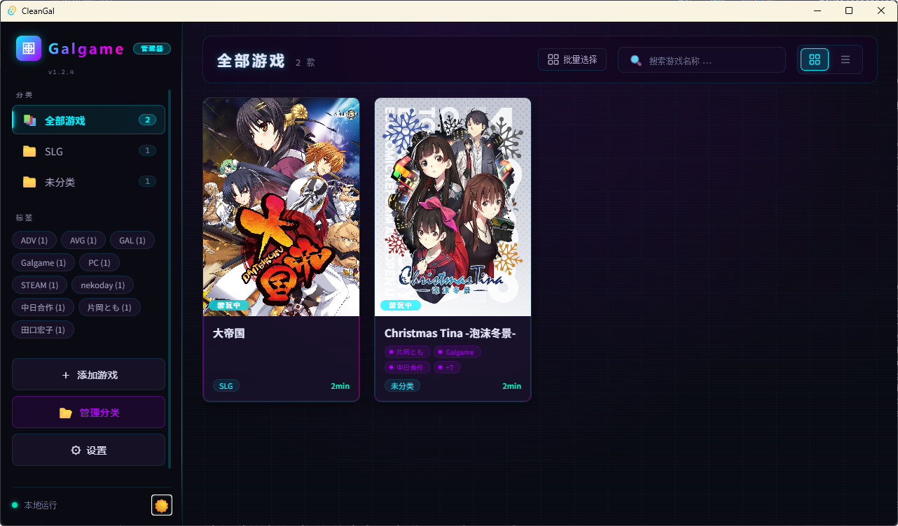

# KurisuGal — Galgame 管理器

基于 **Tauri 2 + Rust** 构建的桌面端 Galgame（视觉小说）管理工具，支持游戏库管理、一键启动、游玩时间统计、Bangumi 数据查询、多分类标签系统等功能，配备赛博朋克风格双主题 UI。

<p align="center">
  
</p>

## 功能特性

### 游戏库管理
- **添加 / 编辑 / 删除** 游戏条目，支持设置名称、别名、路径、分类、标签、简介、封面
- **网格 / 列表双视图** 切换，支持分页（12/24/48/96 每页）
- **搜索过滤**：按名称/别名搜索，按分类/标签筛选
- **批量选择模式**：全选、批量移动到指定分类
- **扫描文件夹**：自动递归扫描目录下所有 .exe 文件

### 游戏启动与监控
- **一键启动**：单击卡片启动按钮或双击卡片启动游戏
- **运行状态实时追踪**：正在运行的游戏卡片显示「游戏中」状态和动画指示器
- **游玩时间统计**：游戏退出时自动记录本次游玩分钟数，累计 `play_time`
- **最后游玩日期**：自动记录 `last_play`（ISO 日期格式）
- **强制结束**：支持从界面终止正在运行的游戏进程

### 游玩状态管理
- 四种状态标记：`未游玩` | `游玩中` | `已通关` | `搁置`
- **卡片悬浮快捷切换**：鼠标悬停封面区显示快捷状态按钮，一键切换
- 首次启动 `未游玩` 的游戏自动切换至 `游玩中`

### Bangumi (bgm.tv) 数据集成
- **游戏搜索**：在添加游戏时通过 Bangumi 搜索游戏名称，自动填充名称、封面、简介、标签
- **详情获取**：v0 API + 旧版 API 双轨策略，v0 失败自动回退旧 API（确保 NSFW 游戏可查到）
- **封面下载**：自动下载封面图片并保存为本地文件
- **条目 ID 直达**：支持直接输入 Bangumi 条目 ID 获取数据
- **调试追踪**：所有 API 请求/响应自动记录到日志文件

### 分类与标签系统
- **自定义分类**：支持新建、重命名、删除分类
- **标签系统**：逗号分隔多标签，侧边栏标签云展示，点击即可筛选
- 分类管理弹窗支持独立管理，删除分类不影响游戏

### 数据管理
- **可配置数据路径**：默认 `程序目录/Data/`，可在设置中修改并通过文件浏览器选择新路径
- **数据迁移**：修改路径时弹出确认对话框，自动迁移所有数据（游戏列表、封面图片、缓存）
- **封面独立存储**：封面从 Base64 内嵌改为 `CoverArt/{game_id}.jpg` 独立文件
- **数据备份与恢复**：导出/导入 JSON 格式完整数据（含游戏数据 + 设置）
- **无效数据清理**：自动检测并移除路径失效的游戏条目
- **旧版本迁移**：自动检测并迁移 v0.x 旧数据到新路径结构

### 设置与个性化
- **三主题**：亮色 + 暗色赛博朋克 + 跟随系统
- **窗口圆角**：0-20px 可调
- **界面缩放**：90% / 100% / 110% / 120%
- **每页显示数量**：12 / 24 / 48 / 96
- **默认启动视图**：网格 / 列表
- **关闭行为**：退出程序 / 最小化到托盘
- **开机自启** (Windows)

### 视觉设计
- 赛博朋克风格暗色主题：霓虹渐变边框、扫描线背景、动态光晕、毛玻璃效果
- 亮色主题：WCAG AA 级对比度，柔和阴影与圆角
- 纯 CSS 动画效果：`@keyframes` 驱动的网格背景、渐变旋转、脉冲指示器
- 模块化 CSS 架构：7 个独立样式文件 + CSS 自定义属性体系

---

## 技术架构

### 整体架构

```
┌──────────────────────────────────────────────────┐
│                   KurisuGal                        │
├──────────────┬───────────────────────────────────┤
│   前端 (Web)  │         后台 (Rust / Tauri)        │
│              │                                  │
│  HTML/CSS/JS │  commands.rs ── Tauri 命令处理    │
│  ES Module   │  bangumi.rs  ── Bangumi API      │
│  原生开发     │  data_store.rs ─ 数据持久化       │
│              │  path_manager.rs ─ 路径管理       │
│              │  settings.rs ─── 设置/校验        │
│              │  game_launcher.rs ─ 进程管理      │
│              │  logger.rs ───── 操作日志         │
│              │  models.rs ───── 数据模型         │
│              │  error.rs ────── 错误体系         │
│              │  utils.rs ────── 工具函数         │
└──────────────┴───────────────────────────────────┘
```

### 技术栈

| 层级 | 技术 | 说明 |
|------|------|------|
| 桌面框架 | Tauri 2.11 | 轻量级跨平台桌面框架 |
| 后端语言 | Rust 2021 Edition | 安全、高性能系统语言 |
| 前端 | 原生 HTML/CSS/JavaScript | ES Module，无框架依赖 |
| 数据存储 | 本地 JSON 文件 | 游戏数据 + 配置文件分离 |
| 封面存储 | 本地独立图片文件 | `CoverArt/` 目录，按游戏 ID 命名 |
| HTTP 客户端 | reqwest 0.12 | 异步 HTTP，TLS 支持 |
| API 集成 | Bangumi API | v0 + 旧版双轨策略 |
| 进程管理 | sysinfo 0.30 | 系统信息采集，进程监控 |
| 文件对话框 | rfd 0.15 | 跨平台原生文件选择器 |
| 日志 | log + 自定义写文件 | 操作日志 + API 追踪 |

### Rust 后端模块

| 模块 | 职责 |
|------|------|
| `main.rs` | 程序入口，`fn main()` 调用 `lib::run()` |
| `lib.rs` | Tauri Builder 配置、命令注册、setup 初始化 |
| `commands.rs` | **27 个 Tauri 命令**：游戏 CRUD、启动、封面、备份、设置、Bangumi、路径管理等 |
| `models.rs` | 数据模型：`Game`、`AppData`、`Settings`、`BangumiFillData` |
| `data_store.rs` | 游戏数据和设置的 JSON 读写（原子写入） |
| `path_manager.rs` | **路径管理核心**：统一管理 C 盘配置 vs 程序目录数据，支持迁移 |
| `settings.rs` | 设置校验、保存、开机自启处理 |
| `game_launcher.rs` | 游戏进程的启动、监控、强制终止 |
| `bangumi.rs` | Bangumi API：搜索、详情、封面下载、调试追踪 |
| `bangumi_test.rs` | Bangumi 模块单元测试 |
| `error.rs` | 统一错误类型 `AppError` + 错误码 `ErrorCode`（19 种） |
| `logger.rs` | 操作日志：游戏操作、API 调用、错误追踪，JSONL 格式 |
| `utils.rs` | 工具函数：`scan_exe_files`、`validate_path` |

### 前端架构

| 文件 | 职责 |
|------|------|
| `index.html` | 主页面：侧边栏、工具栏、游戏网格、4 个弹窗（详情/添加/设置/分类管理）、确认对话框 |
| `main.js` | 前端核心：状态管理、渲染引擎、事件绑定、Tauri invoke 调用 |
| `styles.css` | 样式入口：`@import` 所有 CSS 子模块 |
| `css/variables.css` | CSS 自定义属性：60+ 变量，亮色/暗色双主题 |
| `css/animations.css` | `@keyframes` 动画：扫描线、网格、脉冲、渐变旋转等 12 个动画 |
| `css/base.css` | 全局重置、背景装饰、滚动条、选中文本 |
| `css/layout.css` | 布局：侧边栏、工具栏、游戏网格、列表视图 |
| `css/components.css` | 组件：卡片、按钮、弹窗、表单、Toast、分页、确认框 |
| `css/fonts.css` | 字体体系：UI/标题/内容/等宽分层，日文安全 |
| `css/responsive.css` | 响应式：`< 768px` 移动端适配 |
| `js/utils.js` | 工具函数：`debounce`、`showToast`、`escapeHtml`、`setLoading`、`formatError` |

### 数据存储设计

```
{INSTALL_DIR}/                          ← 程序安装目录
├── KurisuGal.exe
├── Data/                               ← 游戏数据根目录（可配置迁移）
│   ├── game_list.json                  ← 游戏列表
│   ├── CoverArt/                       ← 封面图片（按 game_id.jpg 命名）
│   ├── Saves/                          ← 存档（预留）
│   └── Cache/                          ← 临时缓存

%APPDATA%/KurisuGal/                     ← C 盘系统配置
├── Config/System/path_config.json      ← 数据路径配置
├── Config/User/setting.json            ← 用户设置
├── Logs/operation_log.jsonl            ← 操作日志
└── Backup/kurisu_gal_backup_*.json      ← 数据备份
```

**设计原则**：C 盘最小化——仅存 KB 级配置数据；MB 级封面和游戏数据存程序目录；数据目录可在设置中整体迁移。

---

## Tauri 命令接口

### 游戏管理

| 命令 | 参数 | 返回值 | 说明 |
|------|------|--------|------|
| `get_games` | — | `AppData` | 获取游戏列表 |
| `get_game_covers` | `game_ids: Vec<String>` | `HashMap<String, String>` | 批量获取封面 Base64 |
| `add_game` | `game: Game` | `AppData` | 添加游戏（自动处理封面 Base64→文件） |
| `update_game` | `game: Game` | `AppData` | 更新游戏信息 |
| `delete_game` | `id: String` | `AppData` | 删除游戏和对应封面文件 |
| `quick_update_status` | `game_id, status` | `AppData` | 快捷切换游玩状态 |
| `batch_update_category` | `game_ids, category` | `AppData` | 批量移动游戏到分类 |

### 游戏启动与进程

| 命令 | 参数 | 返回值 | 说明 |
|------|------|--------|------|
| `launch_game` | `game_id, path, args?` | `()` | 启动游戏，后台监控进程退出 |
| `kill_game` | `path: String` | `()` | 强制结束指定游戏进程 |
| `get_running_games` | — | `Vec<String>` | 获取运行中游戏路径列表 |

### 文件与扫描

| 命令 | 参数 | 返回值 | 说明 |
|------|------|--------|------|
| `scan_folder` | `folder: String` | `Vec<String>` | 递归扫描文件夹内 .exe 文件 |
| `open_file_dialog` | `title?, extensions?` | `Option<String>` | 打开文件选择对话框 |
| `pick_folder` | `title?` | `Option<String>` | 打开文件夹选择对话框 |
| `copy_cover` | `source_path, game_id` | `String` | 复制封面图片到 CoverArt/ |

### 数据管理

| 命令 | 参数 | 返回值 | 说明 |
|------|------|--------|------|
| `get_data_root` | — | `String` | 获取当前数据根目录路径 |
| `set_data_root` | `path, migrate?` | `String` | 设置数据目录（可选迁移） |
| `get_data_size_info` | — | `Value` | 获取数据目录文件数/大小/封面数 |
| `backup_data` | — | `String` | 备份数据到 Backup/ 目录 |
| `restore_data` | `file_path` | `()` | 从备份文件恢复数据 |
| `cleanup_invalid` | — | `AppData` | 清理路径失效的游戏条目 |

### 设置

| 命令 | 参数 | 返回值 | 说明 |
|------|------|--------|------|
| `get_settings` | — | `Settings` | 读取用户设置 |
| `save_settings` | `settings: Settings` | `()` | 保存设置（含开机自启处理） |
| `set_startup` | `enabled: bool` | `()` | 单独设置开机自启 |

### Bangumi API

| 命令 | 参数 | 返回值 | 说明 |
|------|------|--------|------|
| `search_bangumi` | `keyword: String` | `Vec<BangumiSearchItem>` | 搜索 Bangumi 游戏 |
| `fetch_bangumi_game` | `subject_id, keyword?` | `BangumiFillData` | 获取详情+封面（含重试&回退） |
| `download_bangumi_cover` | `image_url` | `String` | 单独下载封面为 Base64 |

### 前端事件

| 事件 | 触发时机 | payload |
|------|----------|---------|
| `game-exited` | 游戏进程退出 | `{ game_id, play_time_added, updated }` |

---

## 快速开始

### 环境要求

- [Node.js](https://nodejs.org/) >= 18
- [Rust](https://www.rust-lang.org/) >= 1.70（推荐 1.80+）
- Windows 10/11（当前仅支持 Windows）

### 开发

```bash
# 克隆项目
git clone https://github.com/dleastzh/KurisuGal.git
cd KurisuGal

# 安装前端依赖
npm install

# 启动开发模式（热更新）
npm run tauri dev
```

### 构建

```bash
# 生产构建（生成 .msi + .exe 安装包）
npm run tauri build
```

构建产物位于 `src-tauri/target/release/bundle/`：
- `msi/KurisuGal_1.2.5_x64_en-US.msi`
- `nsis/KurisuGal_1.2.5_x64-setup.exe`

### 发布配置

Release 构建使用最高优化级别：
- `codegen-units = 1` — 单一代码生成单元，最大化内联优化
- `lto = "fat"` — 全链接时优化
- `opt-level = 3` — 最高优化等级
- `panic = "abort"` — 减少二进制体积
- `strip = "symbols"` — 移除调试符号

---

## 使用说明

### 添加游戏

1. 点击侧边栏「＋ 添加游戏」或空白状态「添加游戏」按钮
2. 填写**游戏名称**和**启动程序路径**（必填项）
3. 可选搜索 Bangumi 自动填充名称/封面/简介/标签
4. 可选设置分类、标签、游玩状态、封面图、简介
5. 点击「确认添加」

### Bangumi 查询

1. 在添加游戏弹窗的 Bangumi 搜索框中输入关键词
2. 点击「搜索」，从结果列表选择匹配条目
3. 游戏信息（日文名/中文名/封面/简介/标签/发行日期）自动填充
4. 也可直接输入 Bangumi 条目 ID 并点击「获取」

> 注意：Bangumi 为境外网站，需开启网络代理工具。

### 启动游戏

- **单击**卡片上的播放按钮 ▶
- **双击**游戏卡片
- 运行中的游戏卡片显示「游戏中」状态和呼吸动画
- 游戏退出后自动记录游玩时间和最后游玩日期

### 管理分类

1. 点击侧边栏「📂 管理分类」
2. 新建 / 重命名 / 删除分类
3. 工具栏「批量选择」→ 勾选游戏 → 移动到分类

### 修改数据存储路径

1. 打开设置 → 数据管理
2. 点击「📂 浏览」选择新目录
3. 确认对话框展示风险提示、路径对比、数据统计
4. 点击「确认迁移」自动完成数据迁移

---

## 常见问题

### Q: 游戏启动后没有记录游玩时间？

确保通过 KurisuGal 启动游戏。如果游戏有启动器请设置启动器路径。游戏退出时自动记录本次游玩时间。

### Q: Bangumi 搜索无结果或报错？

检查网络连接和代理状态。可尝试使用游戏日文原名或 Bangumi 条目 ID 直接查询。

### Q: 游戏封面不显示？

支持本地图片选择和 Bangumi 自动下载。封面独立存储为 `CoverArt/{game_id}.jpg` 文件。

### Q: 数据存储在哪里？

- 游戏数据：默认 `程序目录/Data/`，可在设置中修改
- 配置文件：`%APPDATA%/KurisuGal/Config/`
- 可通过「备份数据」导出完整 JSON

### Q: 如何更换主题？

侧边栏底部主题按钮切换，或设置中切换亮色/暗色/跟随系统。

---

## 版本信息

| 项目 | 内容 |
|------|------|
| 当前版本 | v1.2.5 |
| 项目名 | KurisuGal |
| 作者 | CoolSomeBody |
| 技术栈 | Tauri 2 + Rust + 原生 Web 前端 |
| 许可证 | MIT |

---

## License

[MIT](LICENSE)
